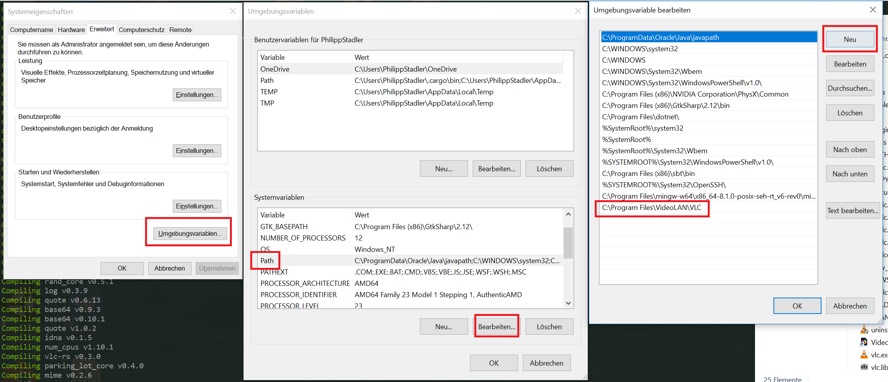

# fernspielapparat
Documentation and code of the _fernspielapparat_ runtime live here.

_fernspielapparat_ is a story telling device that gives you a
text adventure-like experience talking to retro phone.

Games on the _fernspielapparat_ are packaged into _phonebooks_ and
the runtime loads and evaluates them. For this, it accesses
hardware dials through an I2C protocol. System keyboard input is
supported on systems without a dial installed. It provides speech
output through _espeak_ and _libvlc_. An optional hardware bell
is supported through an I2C protocol. The _fernspielapparat_ can
be controlled remotely over the network.

## Getting Started
The source code in this repository is used to build the _fernspielapparat_
runtime. It is the core software component running either on the
target device or on your own computer and enables you to play and test
stories stored in phonebooks.

To create your own phonebooks, check out the
[fernspieleditor](https://krachzack.github.io/fernspieleditor/).
You can build your story there and then send it to a
_fernspielapparat_ over the network.

To get a _fernspielapparat_ up and running, the easiest way is to
download a recent release of the [weichspielapparat](https://github.com/krachzack/weichspielapparat),
which is a graphical user interface that can run on your computer.
The only required setup is to install VLC first, the
_weichspielapparat_ will take care of the rest.

To learn more about the inner workings of the phonebook format,
please read the [specification](doc/Phonebook Spec.md).

### Installing
So you want to install the runtime yourself? This may not be necessary
if you can use the
[weichspielapparat](https://github.com/krachzack/weichspielapparat),
which gives you a graphical user interface for testing and is generally
easier for you to use.
If you want to run the command line interface for advanced usage or
if you want to build your own exhibition with the fernspielapparat runtime,
please read ahead!

The runtime runs on Raspberry Pi 2 or similar systems and also on
common desktop operating systems.

#### Step 1: Install dependencies
The application needs other Software to run, so the first
step is to install these dependencies.

##### Dependencies for what?
For speech synthesis, installing `espeak` is recommended.
For systems other than Windows and Mac, it is required.
To play music and speech to the user, VLC is required.

#### Dependencies: Linux
Make sure `vlc` or `cvlc` is installed through your
favorite package manager. An I2C kernel module is
required for the hardware bell and hardware dial.
`espeak` is also required.

#### Dependencies: Windows
Install VLC through their web site if you have not done
so already. Then, make sure the VLC installation directory
is on the `Path` environment variable, so the runtime
can find it. On my system, `libvlc.dll` is located in
`C:\Program Files\VideoLAN\VLC`. Check yourself and
then add it to `Path` through system settings.

Note: adding to the path is not necessary, if you are using
the runtime through _weichspielapparat_.

On a german locale, traverse through the screens like
this after you have found "Systemumgebungsvariablen bearbeiten"
in the system settings:

If this was too much German for you, there are a lot of
guides on the internet for setting environment variables
on Windows.

Installing `espeak` and adding it to your path is recommended.

#### Dependencies: Mac
Make sure VLC is installed on your system. `espeak` is
recommended, but not required.

Two environment variables are requied for _fernspielapparat_
to find VLC: `DYLD_LIBRARY_PATH` needs to contain the directory
of the VLC executable inside its `.app` bundle. also, you need
to specify the VLC plugin directory with `VLC_PLUGIN_PATH`.
If this information is not available, the runtime will fail to
start.

#### Step 2: Install _fernspielapparat_ Executable
Binary [releases](https://github.com/krachzack/fernspielapparat/releases)
contain the runtime as an executable file `fernspielapparat`
(or `fernspielapparat.exe` on Windows). You can run it from the
command line. You can move it anywhere you like to install it,
the other files shipped with the executable are not required to
run it.

To make `fernspielapparat` available globally, you can add the
containing directory to your `PATH` environment variable or
move the binary to some directory that you know is on the
`PATH`, e.g. `/usr/bin` on many systems. Instead of moving,
you can place a symbolic link in the target directory - this
will make it easier for you to switch between versions later
on.

To build and install the runtime yourself, see the
[compilation guide](COMPILE.md).

### Running
Once the runtime is installed, you can run phonebooks with
`fernspielapparat your_phonebook_here.yaml`.

`fernspielapparat --demo` can be used instead of specifying
a file and loads a demo phonebook embedded in the runtime
executable. It contains speech synthesis and background music
appears after some seconds.

`fernspiealapparat --test` starts diagnostic mode. It will
try to ring the bell for one second and access speech
synthesis.

Use `fernspielapparat --help` for an overview of available
options.

`fernspielapparat --serve` will open a remote control server
available on all network interfaces on port `38397`.

## License
The fernspielapparat project is licensed under the GPLv3.
See [LICENSE](LICENSE) for details.
